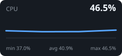
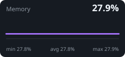
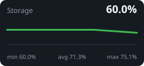

# SATYI HOMELAB

Python • Kubernetes • Proxmox VE • Linux

- Building production-grade infrastructure at home.
- My homelab is where I design, deploy, and test production-inspired systems using Kubernetes, Proxmox, Linux, and Python.
- I enjoy building open-source software that simplifies homelab management or some process at my work.

## Infrastructure

- ☸️ Kubernetes (k3s)
- 🖥️ Proxmox VE
- 🐳 Docker
- 🐧 Linux
- ☁️ Cloudflare
- 🔒 WireGuard
- 💾 Storage & NAS

## Currently Working On

- Standalone Homelab Dashboard
- Kubernetes migration
- Self-hosted monitoring platform
- Learning Nix ecosystem

## Live homelab status

🟠 **Degraded** · refreshed 31 Jul 2026 20:35 UTC

| Host | Kernel | Uptime |
|---|---|---:|
| docker | 6.12.74+deb13+1-amd64 | 2555748 seconds |

| Kubernetes nodes | Pods | Docker containers |
|:--:|:--:|:--:|
| 0 | 0 | 24 |

  

| CPU | Memory | Storage |
|---:|---:|---:|
| 46.5% | 27.9% | 1.7 / 2.8 TB |

> Collector notices: `kubernetes: kubectl unavailable or query failed: exec: "kubectl": executable file not found in $PATH` 

_Generated daily by [homelab-stat-for-bio](https://github.com/schp/homelab-stat-for-bio)._
