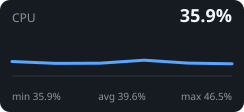
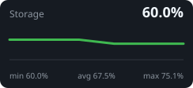

# SATYI HOMELAB

Python • Kubernetes • Proxmox VE • Linux

- Building production-grade infrastructure at home.
- My homelab is where I design, deploy, and test production-inspired systems using Kubernetes, Proxmox, Linux, and Python.
- I enjoy building open-source software that simplifies homelab management or some process at my work.

## Infrastructure
```text
                            ┌───────────────┐
                            │   Proxmox VE  │
                            └───────┬───────┘
                                    │
      ┌─────────────────────────────┼───────────────────────────────┐
      │                             │                               │
┌──────────────────────┐ ┌──────────────────────┐ ┌──────────────────────┐
│ Dell PowerEdge R620  │ │ Dell PowerEdge R410  │ │ Dell PowerEdge R210II│
├──────────────────────┤ ├──────────────────────┤ ├──────────────────────┤
│ CPU                  │ │ CPU                  │ │ CPU                  │
│ 2× Xeon E5-2660      │ │ 2× Xeon X5670        │ │ Xeon E3-1220 v2      │
│                      │ │                      │ │                      │
│ RAM                  │ │ RAM                  │ │ RAM                  │
│ 128 GB DDR3 ECC      │ │ 64 GB DDR3 ECC       │ │ 10 GB DDR3 ECC       │
│                      │ │                      │ │                      │
│ Storage              │ │ Storage              │ │ Storage              │
│ 2×1.8TB SAS          │ │ 4×3TB HDD            │ │ 2×2TB HDD            │
│ 1TB SATA SSD         │ │ 256GB SATA SSD       │ │ 256GB SATA SSD       │
│                      │ │                      │ │                      │
│ GPU                  │ │                      │ │ GPU                  │
│ NVIDIA T1000 8GB     │ │                      │ │ NVIDIA P1000 4GB     │
└──────────────────────┘ └──────────────────────┘ └──────────────────────┘
      │                             │                               │
      └────────────┬────────────────┴──────────────┬────────────────┘
                   │                               │
             ┌────────────┐                  ┌────────────┐
             │ Kubernetes │                  │ Docker     │
             └────────────┘                  └────────────┘
```

- ☸️ Kubernetes (k3s)
- 🖥️ Proxmox VE
- 🐳 Docker
- 🐧 Linux
- ☁️ Cloudflare
- 🔒 WireGuard
- 💾 Storage & NAS

## Currently Working On

- Standalone Homelab Dashboard
- Kubernetes migration
- Self-hosted monitoring platform
- Learning Nix ecosystem

## Live homelab status

🟢 **Healthy** · refreshed 31 Jul 2026 20:38 UTC

| Host | Kernel | Uptime |
|---|---|---:|
| docker | 6.12.74+deb13+1-amd64 | 2555903 seconds |

| Kubernetes nodes | Pods | Docker containers |
|:--:|:--:|:--:|
| 0 | 0 | 24 |

  

| CPU | Memory | Storage |
|---:|---:|---:|
| 35.9% | 27.9% | 1.7 / 2.8 TB |

> Collector notices: `kubernetes: kubectl unavailable or query failed: exec: "kubectl": executable file not found in $PATH` 

_Generated daily by [homelab-stat-for-bio](https://github.com/schp/homelab-stat-for-bio)._
