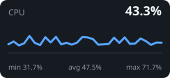
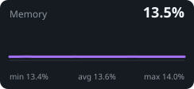
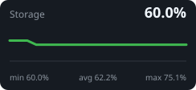

# SATYI HOMELAB

Python • Kubernetes • Proxmox VE • Linux

- Building production-grade infrastructure at home.
- My homelab is where I design, deploy, and test production-inspired systems using Kubernetes, Proxmox, Linux, and Python.
- I enjoy building open-source software that simplifies homelab management or some process at my work.

## Infrastructure

- ☸️ Kubernetes (k3s)
- 🖥️ Proxmox VE
- 🐳 Docker
- 🐧 Linux (Bazzite / Debian)
- ☁️ Cloudflare Tunnels
- 🔒 WireGuard VPN
- 📦 Nextcloud
- 🔐 Vaultwarden
- 💾 Storage & NAS (Jellyfin)

## Currently Working On

- [Warframe Farming Companion](https://github.com/schpeterzon/warframe-farming-companion) — Go backend + React frontend + Linux Python agent with EE.log monitoring, OCR reward detection, K3s deployment
- Kubernetes migration of remaining Docker services
- Self-hosted monitoring platform

## Live homelab status

🟢 **Healthy** · refreshed 26 Sep 2026 14:07 UTC

| Host | Kernel | Uptime |
|---|---|---:|
| docker | 6.12.74+deb13+1-amd64 | 1990747 seconds |

| Kubernetes nodes | Pods | Docker containers |
|:--:|:--:|:--:|
| 0 | 0 | 31 |

  

| CPU | Memory | Storage |
|---:|---:|---:|
| 76.6% | 15.2% | 1.7 / 2.8 TB |

> Collector notices: `kubernetes: kubectl unavailable or query failed: exec: "kubectl": executable file not found in $PATH` 

_Generated every four hours by [homelab-stat-for-bio](https://github.com/schpeterzon/homelab-stat-for-bio)._
