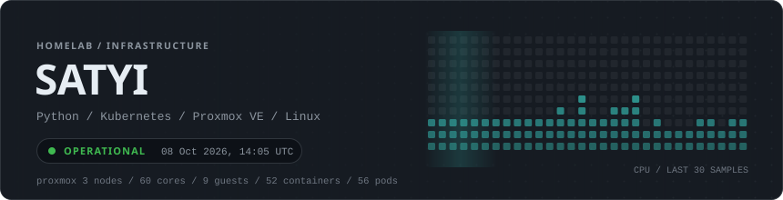
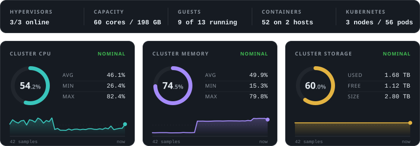
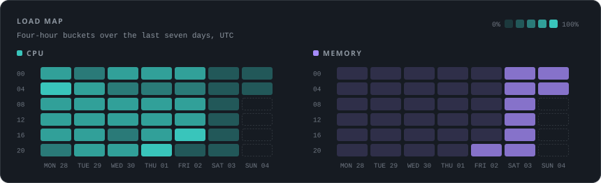
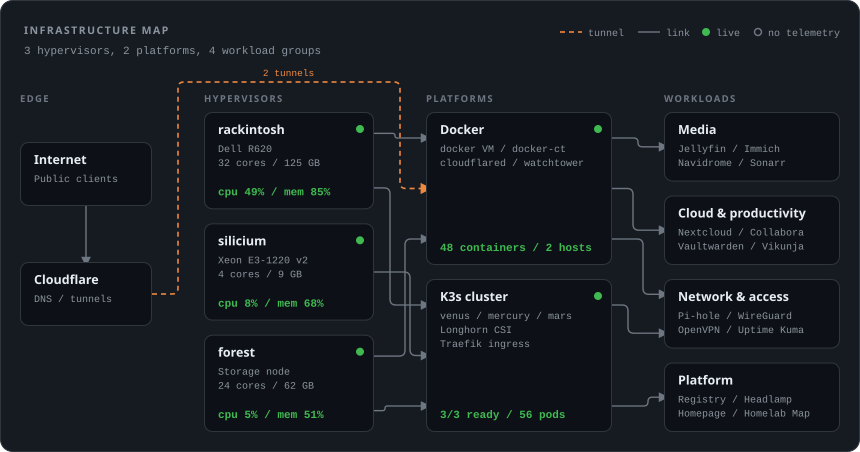
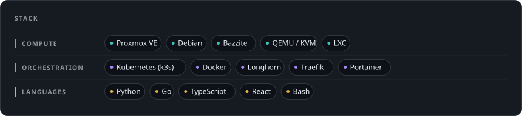

<picture>
  <source media="(prefers-color-scheme: dark)" srcset="assets/header-dark.svg">
  <source media="(prefers-color-scheme: light)" srcset="assets/header-light.svg">
  
</picture>

I design, deploy, and operate production-style infrastructure at home: a three-node Proxmox VE cluster running a K3s Kubernetes cluster alongside Docker hosts, exposed through Cloudflare Tunnels. The homelab is where I test ideas before they reach work, and where I build open-source tooling that makes running it simpler.

## Live status

<picture>
  <source media="(prefers-color-scheme: dark)" srcset="assets/metrics-dark.svg">
  <source media="(prefers-color-scheme: light)" srcset="assets/metrics-light.svg">
  
</picture>

<picture>
  <source media="(prefers-color-scheme: dark)" srcset="assets/loadmap-dark.svg">
  <source media="(prefers-color-scheme: light)" srcset="assets/loadmap-light.svg">
  
</picture>

## Infrastructure

<picture>
  <source media="(prefers-color-scheme: dark)" srcset="assets/topology-dark.svg">
  <source media="(prefers-color-scheme: light)" srcset="assets/topology-light.svg">
  
</picture>

<picture>
  <source media="(prefers-color-scheme: dark)" srcset="assets/stack-dark.svg">
  <source media="(prefers-color-scheme: light)" srcset="assets/stack-light.svg">
  
</picture>

Snapshot 07 Oct 2026, 06:01 UTC. Rendered every four hours by <a href="https://github.com/schpeterzon/homelab-stat-for-bio">homelab-stat-for-bio</a>. Raw data: <a href="status.json">status.json</a>.
